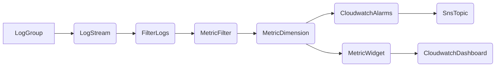

# Terraform Simple Store Demo

Terraform script to create:

- Cloudwatch Log stream
- Cloudwatch Log group
- Metric filters
- Cloudwatch dashboard
- Cloudwatch alarms
- SNS topic

## Table of contents

- [Resources Module](#product-module)
- [Variables](#discount-module)

### Resources Module:

The resources created will interact in the following order:



### Variables Module:

Our variables file should have the following required variables:

```terraform
variable "account-id" {
  type        = string
  description = "Id for the account resources are to be created"
}

variable "dispay_name" {
  type        = string
  description = "SNS Topic Display Name"
}

variable "alarm_rules" {
  type        = string
  description = "Alarm rules for the Composite Alarm ie. "ALARM (demoalarmname) OR ALARM (demoalarmname2)""

}

variable "alarm_configs" {
  type        = map(map(any))
  description = "Alarm configuration for the cloudwatch alarm"
}

variable "sns_topic_name" {
  type        = string
  description = "SNS Topic Display Name"
}

variable "log_group_name" {
  type        = string
  description = "Cloudwatch log group name"
}

variable "log_stream_name" {
  type        = string
  description = "Cloudwatch log stream name"
}

variable "tags" {
  type        = map(any)
  description = "Tags for resources"
}

variable "composite_alarm_description" {
  type        = string
  description = "Composite alarm description"
}

variable "composite_alarm_name" {
  type        = string
  description = "Cloudwatch alarm name"
}
```

Our alarms config should be in the following format:

```hcl
## Dummy alarm config for adding a single product

alarm_configs = {
  getproductbyidconfig = {
    metric_filter_name         = "getProductbyId" // Metric filter name
    log_filter_pattern         = "{$.demoaction= getproductbyid}" // Filter pattern for the logs
    dimenisonvalue             = "getproductbyid"   // Dimension to filter by the alarm
    metric_name                = "getProductbyId" // Metric name
    metric_value               = 1
    metric_namespace           = "DemoMetrics" // Alarm namespace
    alarm_name                 = "getproduct_alarm" // Alarm name
    alarm_description          = "Alarm for when a product is fetched" //Alarm description
    metric_statistic           = "SampleCount" //Count number of metrics found
    metric_period              = 86400 //1 day in seconds
    metric_threshold           = 10 // threshold set for the metrics
    metric_evaluation_periods  = 1
    metric_comparison_operator = "GreaterThanOrEqualToThreshold" // Threshold comparison operator in this case: should not be greater than the set threshold
    metric_treat_missing_data  = "notBreaching"
  },
}
```